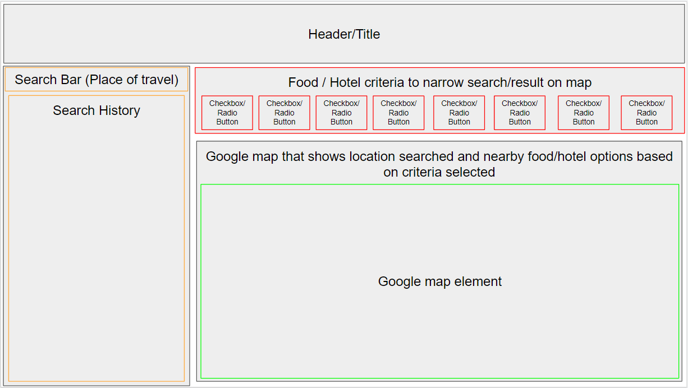

# Project 1: Name TBD

## About this application
Our first group project is themed around travel and food (hotels as a backup). We plan to use two server side APIs which will take 
information given by the user and return appropriate options for the guidelines they have set out. 

We will establish a search bar or form for the user to input their desired options, and we will use a map API combined with a food 
(or hotel) by country API to showcase the options available to the user.

## User Story

As a user I want a website where I can input where I'm coming from, where I want to go, what time I want to leave and I am given a list of hotels nearby my destination. After I select a hotel, I want to be given driving directions.

## The Journey
After the APIs and functionality base was selected a 1st draft wireframe sketch was made (as seen below)

## Made with
* HTML
* CSS
* Javascript
